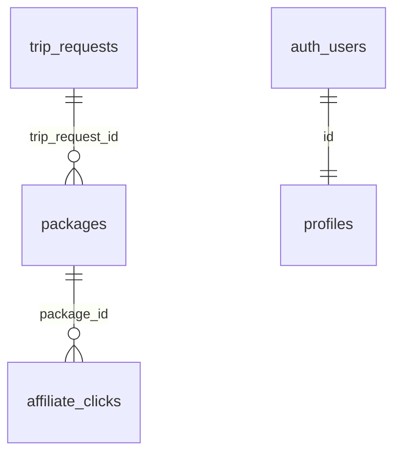

# Database

Backend: Lovable Cloud (Supabase / Postgres). Schema source of truth: `supabase/migrations/*.sql` and `src/integrations/supabase/types.ts`.

## Tables

### public.trip_requests
Purpose: stores the raw travel brief and extracted trip fields for one planning request.

| Column | Type | Notes |
|---|---|---|
| id | uuid | PK, default `gen_random_uuid()` |
| destination | text | nullable |
| departure_airport | text | nullable |
| travelers | int | nullable |
| budget | int | nullable |
| travel_dates | text | nullable |
| vacation_type | text | nullable |
| preferences | jsonb | nullable |
| raw_brief | text | nullable |
| created_at | timestamptz | not null, default `now()` |

Written by `/api/chat` (`raw_brief`, `destination`) using the service-role client.

### public.packages
Purpose: stores the generated travel packages belonging to a trip request.

| Column | Type | Notes |
|---|---|---|
| id | uuid | PK, default `gen_random_uuid()` |
| trip_request_id | uuid | FK → `trip_requests.id` ON DELETE CASCADE |
| package_type | text | not null (`basic` / `medium` / `premium` values are written by the app) |
| title | text | |
| price | int | |
| rating | numeric | |
| match_score | int | |
| summary | text | |
| data | jsonb | not null — the full `TravelPackage` object |
| created_at | timestamptz | not null, default `now()` |

Written by `/api/chat` (insert) and `/api/refine-package` (update, only when the package id is a UUID).

### public.affiliate_clicks
Purpose: click log for affiliate outbound links.

| Column | Type | Notes |
|---|---|---|
| id | uuid | PK, default `gen_random_uuid()` |
| package_id | uuid | FK → `packages.id` ON DELETE SET NULL, nullable |
| provider | text | |
| url | text | |
| created_at | timestamptz | not null, default `now()` |

Written by `/api/track-click`.

### public.profiles
Purpose: per-user profile row, auto-created on signup.

| Column | Type | Notes |
|---|---|---|
| id | uuid | PK, FK → `auth.users.id` ON DELETE CASCADE |
| display_name | text | |
| avatar_url | text | |
| created_at | timestamptz | not null, default `now()` |
| updated_at | timestamptz | not null, default `now()`, maintained by trigger |

## Functions & triggers
- `public.update_updated_at_column()` — sets `updated_at = now()`; trigger `update_profiles_updated_at` BEFORE UPDATE ON `profiles`.
- `public.handle_new_user()` (SECURITY DEFINER) — inserts a `profiles` row from `auth.users` metadata; trigger `on_auth_user_created` AFTER INSERT ON `auth.users`.
- EXECUTE on both functions is revoked from `PUBLIC`, `anon`, `authenticated`.

## Row Level Security
RLS is enabled on `trip_requests`, `packages`, `affiliate_clicks`, `profiles`.

| Table | Policies currently in effect |
|---|---|
| trip_requests | none — the public read policy was dropped in migration `20260525043059` |
| packages | none — the public read policy was dropped in migration `20260525043059` |
| affiliate_clicks | none — the public insert policy was dropped in migration `20260519061831` |
| profiles | `Users can view/insert/update their own profile` (`auth.uid() = id`, role `authenticated`) |

All server writes to `trip_requests`, `packages` and `affiliate_clicks` go through the service-role client (`src/integrations/supabase/client.server.ts`), which bypasses RLS. No client-side reads of these three tables were found in the source.

## Relationships

## Indexes / constraints
Only the primary keys and the foreign keys listed above are defined in the migrations. No additional indexes or check constraints were found in the current project.
