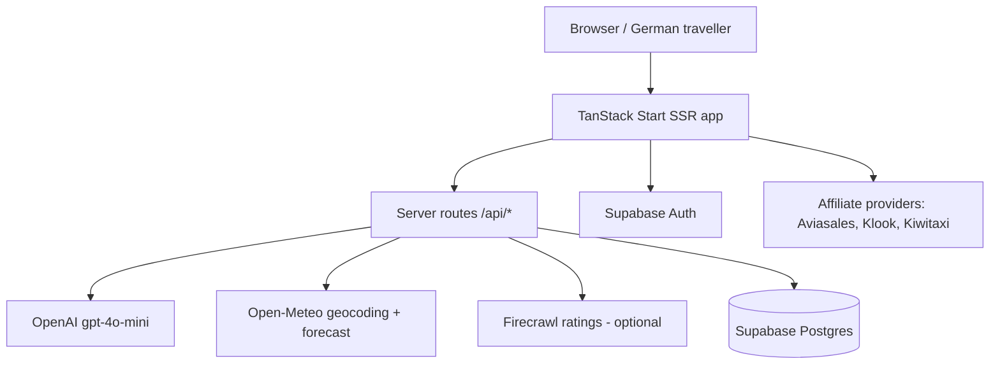
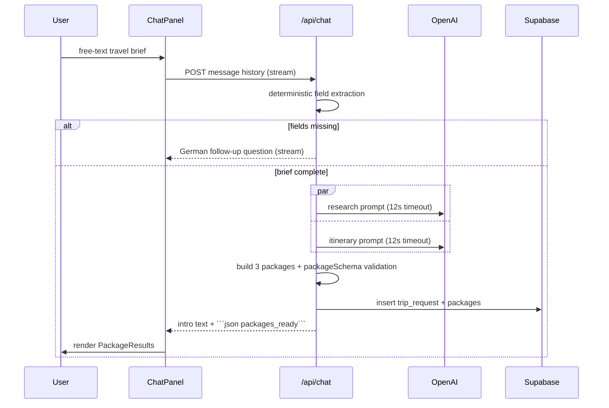

# System Architecture

## High-level

## Frontend
- React 19 with TanStack Router file routes in `src/routes`. Root layout and head/analytics in `src/routes/__root.tsx`; router created in `src/router.tsx` (`scrollRestoration: true`).
- The homepage (`src/routes/index.tsx`) holds the whole planner state: chat → results → detail.
- `ChatPanel.tsx` implements its own `fetch` + `ReadableStream` client against `/api/chat` (deliberately not `useChat`, to avoid vendor chunk issues). Hero particles are deterministic (`Math.sin`) to avoid hydration mismatches.
- Styling: Tailwind v4 tokens in `src/styles.css`; shadcn/ui components in `src/components/ui`.

## Backend
- Server routes (`createFileRoute` + `server.handlers`) under `src/routes/api/`. There are no Supabase edge functions.
- Runtime target is a Cloudflare Worker (`src/server.ts`, `wrangler.jsonc`, `nodejs_compat`).
- `src/start.ts` configures the Start instance; `src/lib/error-capture.ts` and `src/lib/error-page.ts` handle SSR errors.

## Database
Supabase Postgres, tables `trip_requests`, `packages`, `affiliate_clicks`, `profiles`. Server writes use the service-role client `src/integrations/supabase/client.server.ts` (imported dynamically inside handlers so it never enters the client bundle).

## Authentication
Supabase email/password. `AuthProvider` (`src/hooks/use-auth.tsx`) subscribes to `supabase.auth.onAuthStateChange` first, then reads the existing session, and invalidates React Query + the router on change. `src/integrations/supabase/auth-attacher.ts` and `auth-middleware.ts` exist (generated) for bearer-token attachment; no API route currently requires auth.

## Data flow — package generation

## Component communication
- `index.tsx` owns `packages` / `selectedPackage` state; `ChatPanel` reports readiness via `onPackagesReady`, `PackageResults` reports selection via `onSelect`, `PackageDetail` calls `/api/refine-package` and `/api/itinerary-weather`.
- No global store beyond React state, the auth context, and the TanStack Query client.

## Request/response conventions
- `/api/chat` streams plain text; the structured payload is embedded as a fenced JSON block that the client parses.
- The other API routes return JSON via `Response.json`.

## Important system dependencies
The planner is unavailable without a working AI backend: `resolveAiBackend()` returns `null` when `OPENAI_API_KEY` is absent, and the routes then answer with a German "service unavailable" message.
